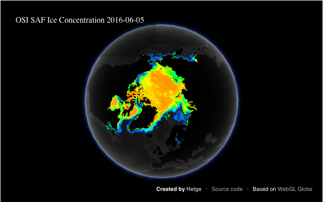

This is a small Python project, which allows you to plot geo-located data onto a [WebGL Globe](https://www.chromeexperiments.com/globe) ([WebGL Sources](https://github.com/dataarts/webgl-globe))





Install
=======

Currently, the project is not on PyPi. So either install it manually by 


```bash
pip install trollplot --no-index --find-links file:///path/to/trollplot/dist/trollplot-1.0.tar.gz
```
or 
```bash
cd /path/to/trollplot/dist/trollplot-1.0.tar.gz
python setup.py install
```


Alternatively, you can clone the repository:


```bash
git clone https://github.com/HelgeDMI/trollplot.git

```

Subsequently, add `trollplot` to your Python path. In case you are using `virtualenv-wrapper`:

```bash
add2virtualenv /path/to/trollplot
```

Requirements
============

Python 2.7 Note, the HTTP server will not work with Python 3 directly.

You will need to have the following Python modules to be installed in your environment:
```
Jinja2
ipython notebook
```

To display the plots you will need a browser which supports WebGL. I tested Firefox, Chromium, Safari, and Opera. They all work, but it seems that WebKit-based browsers are performing better. The program is only tested on Ubuntu and OS X, not on Windows.


Usage
=====


```python
import numpy as np
from globeplot.plotting import GlobePlot


# data and coordinates are one- or two-dimensional NumPy arrays
lats = np.array([...])
lons = np.array([...])
values = np.array([...])

plot = GlobePlot(lats=lats, lons=lons, data=values)

# append more data to the plot if needed
plot.append(more_lats, more_lons, more_values)

plot.show(title='A GlobePlot', creator='You', creator_addr='http://...',
          code_link='http://...')
```

How does it Work?
=================


`trollplot`, is a thin Python wrapper around WebGL Globe. It populates an HTML template (Jinja2) with a JSON list of latitude, longitude and numerical values, which is generated out of one- or two-dimensional NumPy arrays. In the following is a snippet of the `index_template.html`. Note `{{data_list}}`, which is a place holder for the array, which is generated out od the NumPy arrays.

```javascript
var loadData = function() {
    document.getElementById('load').innerHTML = 'Loading...';
    var data = {{data_list}};
    window.data = data;
    globe.clearData();
    globe.addData(data);
    globe.createPoints();
    globe.animate();
    document.getElementById('load').innerHTML = ' ';
};
```

The following snippet of `plotting.py` shows the function, which renders the HTML template. In particular `data_list = json.dumps(data)` dumps a JSON array of latitude, longitudes and values into the HTML template.

```python
def _generate_html(self, data, title='Globe Plot',
                   creator='GlobePlot', creator_addr='http://...',
                   code_link='http://...'):
    base = resource_filename('globeplot', '')

    base = os.path.split(base)[0]
    template_file = os.path.join(base, 'webgl_globe',
                                 'index_template_small.html')
    rendered_file = os.path.join(base, 'webgl_globe', 'index.html')
    data_list = json.dumps(data)

    html_path = os.path.split(template_file)[0]
    env = Environment(loader=FileSystemLoader(html_path))

    template = env.get_template(os.path.split(template_file)[1])
    html = template.render(title=title, data_list=data_list,
                           creator=creator, creator_addr=creator_addr,
                           code_link=code_link)

    with open(rendered_file, 'w') as f:
        f.write(html)

    return html
```


I Want to See an Example Quickly!
=================================

There is an example plot with the OSI SAF ice concentration corresponding to the June 8th 2016 in the `doc/` folder.

To view this locally do the following:

```bash
git clone https://github.com/HelgeDMI/trollplot.git
cd /path/to/trollplot/doc/example_plot/
python -m SimpleHTTPServer
```

Open your browser, which has to support WebGL, on `http://localhost:8000` and you will see the plot.

Additionally, there is an IPython notebook `doc/Globe Plot Example.ipynb` which you can use to experiment with the plots. Note, for this example notebook you need to install the `netcdf4` module.